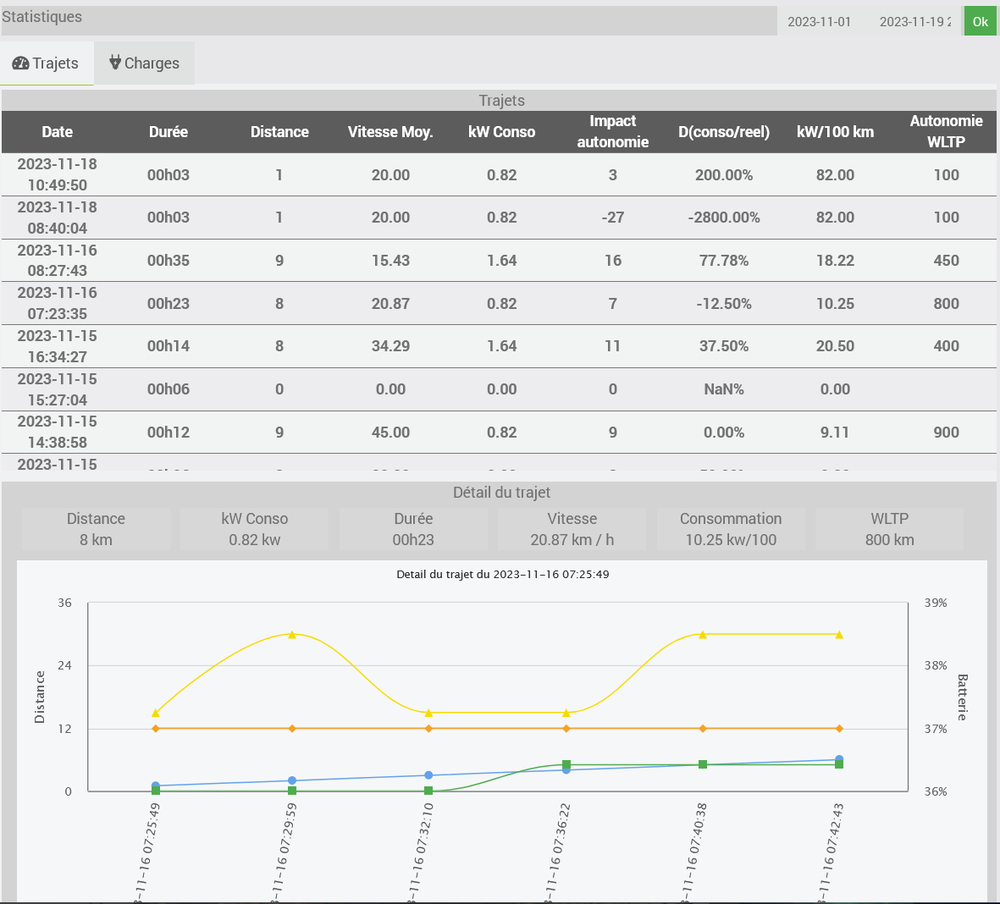

# Plugin Jeeda

# Description
Le plugin **Jeeda** permet de récupérer les informations des véhicules liés à un compte Skoda Connect.
IL donne accès au modèle, kilométrage et diverses informations en fonction du véhciles et des options activées dans le compte SKoda Connect.
* [**Tous véhicules**] 
    - Kilomètrage
    - Modèle
    - Année de construction
    - Image
    - Véhicule vérouillé ou pas
    - Fenêtre ouverte ou pas

* [**Véhicule thermique**]
    - Réservoir
    - Autonomie estimée

* [**Véhicule électrique**]
    - % batterie
    - % Capacité de la batterie
    - Autonomie estimée
    - Véhicule branché ou non
    - Charge en cours
    - Puissance de charge
    - Limite de charge (par exemple 80%)
    - Gain en kilométre par heure
    - Temps de charge estimé

* [**Véhicule avec climatisation**]
    - Consigne de la climatisation
    - Temps restant

Les valeurs sont récupérées régulierement en fonction de l'état du véhicule :
* Parking, en charge : toutes les 10 minutes
* Conduite : toutes les 2 minutes

Une tuile permet d'ajouter une vue succinte du véhicule.

Le panel dédié permet de consulter les trajets pour une période donnée avec 
* la date et l'heure de début du trajet, 
* la durée du trajet, 
* la distance parcouru, 
* la vitesse moyenne, 
* la consommation en kw pour les véhicules électriques
* l'impact du trajet sur l'autnomie pour les véhicules électriques
* Le ratio entre l'impact sur l'autonomie et la distance parcouru pour les véhicules électriques
* kw/100 du trajet pour les véhicules électriques
* Projection de l'autonomie du véhicule sur le trajet (pseudo WLTP en fonction des conditions du trajet)

Pour chaque trajet un graphique présente les informations du trajet.
* Vitesse entre 2 mesures
* Evolution de la batterie
* Kilomètre parcouru
* Kilomètre consommé

# Configuration du plugin

Après avoir installé le plugin, il faut l’activer, installer des dépendances puis renseigner les informations du compte SKoda Connect (login et mot de passe), **important** il faut renseigner la durée du cycle d'interrogation des serveurs SkodaConnect (pour le cycle standard et le cycle de conduite) et enfin lancer le démon pour récupérer les informations.
Le cycle de conduite est enclenché automatiquement lorsque le véhicule est en mouvement. Il permet d'avoir une vision plus précise du trajet. 
Le cycle standard est automatiquement utilisé dès que le véhicule est à l'arret (parking ou en charge).
> **Tips**
>
> Les serveurs SkodaConnect limitent le nombre de demande à 7 700 par jour. Au delà une erreur type 429 est retourné et aucun information n'est envoyée.

> **Important**
>
> Il faut redémarrer le démon après chaque changement d'information sur le compte.

Vous trouverez dans la vue du plugin l'ensemble des véhicules associés à votre compte. 

> **Tips**
>
> Le bouton synchronisation permet de récupérer manuellement les informations du compte sans attendre que le démon se lance.

> **Tips**
>
> En cas de lancement d'une synchronisation manuelle, une erreur peut apparaître dans les logs du démon. Le prochain réveil du démon resoudra le problème.

# Configuration des équipements

Vous retrouvez ici la configuration de votre équipement :

-   **Nom de l’équipement** : nom de votre véhicule
-   **Activer** : permet de rendre votre équipement actif
-   **Visible** : rend votre équipement visible sur le dashboard
-   **Objet parent** : indique l’objet parent auquel appartient l’équipement
-   **Fonctionnalités** : indique les fonctions rendues disponibles via les API Skoda Connect. Celle qui sont cochées correspondent aux possibilités du véhicule.

> **Tips**
>
> Toutes les fonctionnalités n'ont pas pu être testées et ne sont potentiellement pas présentées dans le dashboard et le panel. Cependant les informations associées sont récupérées.

L'onglet commande présente toutes les informations récupérées régulièrement.

# Divers
Le plugin s'appuie sur la librairie [SkodaConnect](https://github.com/skodaconnect/skodaconnect)